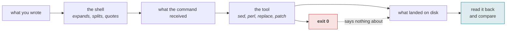
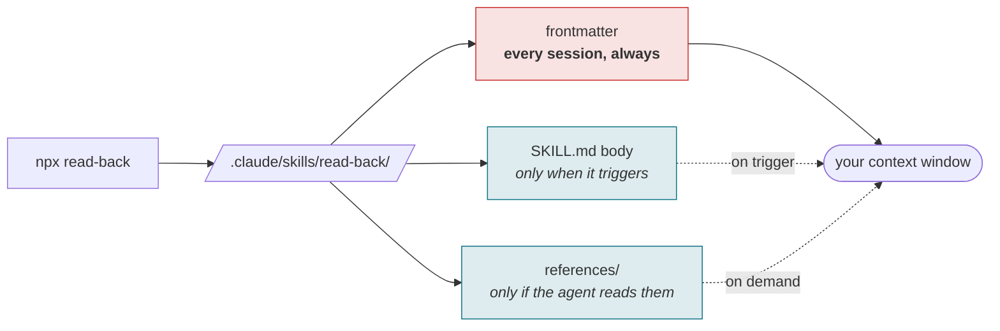
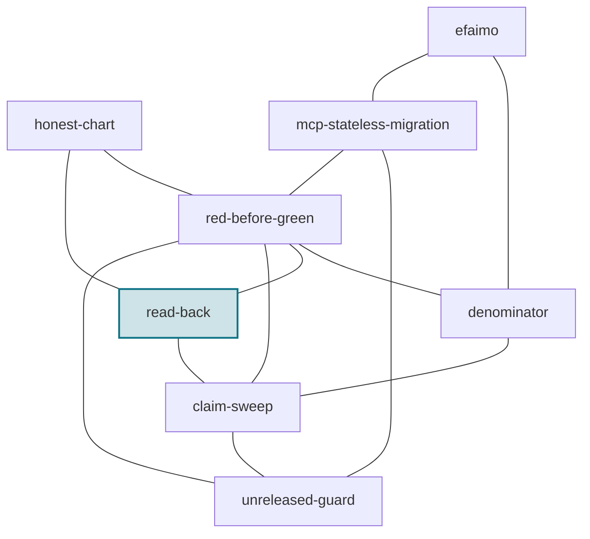

# read-back

[](https://www.npmjs.com/package/read-back)
[](LICENSE)
[-0b7285)](https://efaimo.ai/skills)
[](https://github.com/efaimo-ai/read-back/actions/workflows/house-style.yml)

An Agent Skill. **A write that reported success may not have applied, or may
have applied something other than what you wrote.** This is the discipline for
noticing before you build on it.

```
Skill: read-back
```

Drop the directory into your skills path. There is nothing to install and no
dependencies; the whole thing is `SKILL.md` plus one reference file.

<!-- generated:install -->

## Install

```sh
npx read-back                 # into ./.claude/skills/read-back/
npx read-back --global        # into ~/.claude/skills/read-back/
npx read-back --check         # installed, and current?
```

The package is the skill: `SKILL.md` and its `references/`, nothing else. The
installer copies them, reads every byte back, and fails if what landed is not
what it wrote. It refuses to overwrite a directory whose contents differ unless
you pass `--force`, and installing the same version twice is a success rather
than a conflict.

Or take it by hand. It is markdown; `npx read-back --print` writes `SKILL.md` to
stdout, and the repository is the whole thing.

<!-- /generated:install -->

## Where a write goes wrong



Two independent ways to succeed at nothing: a shell that rewrote the payload it
carried, and a replacement that matched nothing and exited 0 for it.

## The problem

Two mechanisms, both silent.

**A shell is a compiler, not a pipe.** Everything on a command line is parsed
and rewritten before your program sees a byte. Backticks become command
substitution, `$name` expands, backslashes fold, quotes are consumed. The shell
reports success because from its point of view it did exactly what it was told.
Your payload arrives modified and nothing says so.

**A replacement that matches nothing is not an error.** `sed -i`, `perl -pi`,
and `str.replace` all exit 0 and return happily when the pattern was never
there. "I replaced it" and "there was nothing to replace" produce identical
output.

Put together: a command exits 0, your script prints the success line you wrote
into it, and the file on disk is not what you authored.

## The move

1. Make the write assert its preconditions. Fail unless the target appears
   exactly the number of times you expect. Zero is a failure, not a no-op.
2. Keep the payload off the command line. Write it to a file; a file's bytes are
   yours.
3. Prefer a structured edit tool, which fails loudly on an absent match.
4. Read back the changed region, unless the tool already failed loudly. The
   bytes, not the exit code.
5. Then run the thing that depends on it.

## Relation to red-before-green

`red-before-green` is the same suspicion aimed at **instruments**: make a check
produce a positive on purpose before believing its green. This is aimed at
**actuators**. A green you have not tested and a write you have not read back
are the same mistake in two directions, and the write is the quieter of the two,
because a failed check at least leaves you a result to argue with.

## Provenance

Every failure in `references/failure-gallery.md` is one that actually happened,
with what it printed. The worst is not any of the loud ones. It is a patch
script that printed its own success line while two backtick-quoted spans had
been eaten out of the text it wrote, leaving two holes in a file, with an exit
code of 0.

## License

Apache-2.0. See `LICENSE` and `NOTICE`.


<!-- generated:pipeline -->

## What installing it does to a session

A skill is not free just because it is markdown. Its frontmatter is loaded at
the start of every session for every skill you have installed, whether or not it
ever fires.



In this skill's case, measured by [efaimo](https://github.com/efaimo-ai/efaimo) `weigh` (v0.5.0, 2026-09-04):
**81 tokens always resident**, 1,172 when it triggers, 1,717 across 1 reference file if the agent reads to the end.

<!-- /generated:pipeline -->

<!-- generated:set -->

## The set

Every skill in this set is about a report that was true about the wrong thing.

| skill | something reported | what the report was really about |
|---|---|---|
| [`red-before-green`](https://github.com/efaimo-ai/red-before-green) | a check said clean | whether it ran at all |
| [`denominator`](https://github.com/efaimo-ai/denominator) | a check said clean | how much of the world it saw |
| **`read-back`** | a write said done | whether it applied |
| [`claim-sweep`](https://github.com/efaimo-ai/claim-sweep) | a change said done | everything else still asserting the old value |
| [`unreleased-guard`](https://github.com/efaimo-ai/unreleased-guard) | a document said true | which version it is true of |
| [`honest-chart`](https://github.com/efaimo-ai/honest-chart) | a picture said the data | whether its geometry is proportional |
| [`mcp-stateless-migration`](https://github.com/efaimo-ai/mcp-stateless-migration) | a server said ok | which revision it speaks |
| [`efaimo`](https://github.com/efaimo-ai/efaimo) | a tool said A(100) | what a grade certifies, and what it costs |



Each edge is a real handoff, not a category: the reason one skill points at
another is written into it at [efaimo.ai/skills](https://efaimo.ai/skills), and
in the `Siblings` section of every `SKILL.md`. All of them are graded and
weighed by [`efaimo`](https://github.com/efaimo-ai/efaimo), the CLI that measures
what an agent loads.

<!-- /generated:set -->

## License

Apache-2.0. See [`LICENSE`](LICENSE) and [`NOTICE`](NOTICE).
