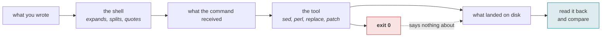

# read-back

[](LICENSE)
[-0b7285)](https://efaimo.ai/skills)
[](https://github.com/efaimo-ai/read-back/actions/workflows/house-style.yml)

An Agent Skill. **A write that reported success may not have applied, or may
have applied something other than what you wrote.** This is the discipline for
noticing before you build on it.

```
Skill: read-back
```

Drop the directory into your skills path. There is nothing to install and no
dependencies; the whole thing is `SKILL.md` plus one reference file.

## Where a write goes wrong



Two independent ways to succeed at nothing: a shell that rewrote the payload it
carried, and a replacement that matched nothing and exited 0 for it.

## The problem

Two mechanisms, both silent.

**A shell is a compiler, not a pipe.** Everything on a command line is parsed
and rewritten before your program sees a byte. Backticks become command
substitution, `$name` expands, backslashes fold, quotes are consumed. The shell
reports success because from its point of view it did exactly what it was told.
Your payload arrives modified and nothing says so.

**A replacement that matches nothing is not an error.** `sed -i`, `perl -pi`,
and `str.replace` all exit 0 and return happily when the pattern was never
there. "I replaced it" and "there was nothing to replace" produce identical
output.

Put together: a command exits 0, your script prints the success line you wrote
into it, and the file on disk is not what you authored.

## The move

1. Make the write assert its preconditions. Fail unless the target appears
   exactly the number of times you expect. Zero is a failure, not a no-op.
2. Keep the payload off the command line. Write it to a file; a file's bytes are
   yours.
3. Prefer a structured edit tool, which fails loudly on an absent match.
4. Read back the changed region, unless the tool already failed loudly. The
   bytes, not the exit code.
5. Then run the thing that depends on it.

## Relation to red-before-green

`red-before-green` is the same suspicion aimed at **instruments**: make a check
produce a positive on purpose before believing its green. This is aimed at
**actuators**. A green you have not tested and a write you have not read back
are the same mistake in two directions, and the write is the quieter of the two,
because a failed check at least leaves you a result to argue with.

## Provenance

Every failure in `references/failure-gallery.md` is one that actually happened,
with what it printed. The worst is not any of the loud ones. It is a patch
script that printed its own success line while two backtick-quoted spans had
been eaten out of the text it wrote, leaving two holes in a file, with an exit
code of 0.

## License

Apache-2.0. See `LICENSE` and `NOTICE`.


## The set

Seven skills, each one a discipline that cost something to learn.

| skill | the question it asks |
|---|---|
| [`red-before-green`](https://github.com/efaimo-ai/red-before-green) | can this check fail at all? |
| [`denominator`](https://github.com/efaimo-ai/denominator) | how much of the world can it see? |
| **`read-back`** (this one) | did the write actually apply? |
| [`claim-sweep`](https://github.com/efaimo-ai/claim-sweep) | what else still asserts the old value? |
| [`unreleased-guard`](https://github.com/efaimo-ai/unreleased-guard) | does the copy describe what shipped? |
| [`honest-chart`](https://github.com/efaimo-ai/honest-chart) | is the picture proportional to the data? |
| [`mcp-stateless-migration`](https://github.com/efaimo-ai/mcp-stateless-migration) | does this server match the 2026-07-28 spec? |

All of them are audited by [`efaimo`](https://github.com/efaimo-ai/efaimo), the
CLI that measures the quality and context-window cost of MCP servers and Agent
Skills. The index of every public skill it can find, graded, is at
[efaimo.ai/skills](https://efaimo.ai/skills).

## License

Apache-2.0. See [`LICENSE`](LICENSE) and [`NOTICE`](NOTICE).
